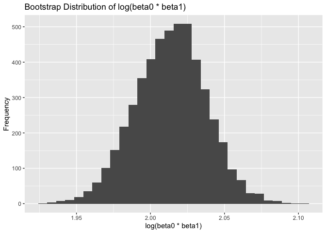

p8105_hw6_rw3033
================

# Libraries

``` r
library(dplyr)
```

    ## 
    ## Attaching package: 'dplyr'

    ## The following objects are masked from 'package:stats':
    ## 
    ##     filter, lag

    ## The following objects are masked from 'package:base':
    ## 
    ##     intersect, setdiff, setequal, union

``` r
library(broom)
```

    ## Warning: package 'broom' was built under R version 4.4.1

``` r
library(purrr)
library(ggplot2)
library(tidyr)
```

# Question 1

``` r
weather_df = 
  rnoaa::meteo_pull_monitors(
    c("USW00094728"),
    var = c("PRCP", "TMIN", "TMAX"), 
    date_min = "2017-01-01",
    date_max = "2017-12-31") %>%
  mutate(
    name = recode(id, USW00094728 = "CentralPark_NY"),
    tmin = tmin / 10,
    tmax = tmax / 10) %>%
  select(name, id, everything())
```

    ## using cached file: /Users/wuruiyang/Library/Caches/org.R-project.R/R/rnoaa/noaa_ghcnd/USW00094728.dly

    ## date created (size, mb): 2024-11-21 18:06:08.370764 (8.667)

    ## file min/max dates: 1869-01-01 / 2024-11-30

``` r
# Perform 5000 bootstrap samples and fit the linear model
bootstrap_results = weather_df |>
  modelr::bootstrap(n = 5000, id = "bootstrap_id") |>
  mutate(
    models = map(strap, ~ lm(tmax ~ tmin, data = .x)),
    # R^2
    r_squared = map_dbl(models, function(model) glance(model)[["r.squared"]]),
    # log(beta0 * beta1)
    log_beta_product = map_dbl(models, function(model) {
      coefs <- tidy(model)[["estimate"]]
      log(coefs[1] * coefs[2])
    })
  )

# CI of the bootstrap results
ci_results = bootstrap_results |>
  summarise(
    r_squared_lower = quantile(r_squared, 0.025),
    r_squared_upper = quantile(r_squared, 0.975),
    log_beta_product_lower = quantile(log_beta_product, 0.025),
    log_beta_product_upper = quantile(log_beta_product, 0.975)
  )
```

``` r
# Plot the distributions
# R-squared distribution
ggplot(bootstrap_results, aes(x = r_squared)) +
  geom_histogram() +
  labs(title = "Bootstrap Distribution of R-squared",
       x = "R-squared",
       y = "Frequency")
```

    ## `stat_bin()` using `bins = 30`. Pick better value with `binwidth`.

<!-- -->

``` r
# Log(beta0 * beta1) distribution
ggplot(bootstrap_results, aes(x = log_beta_product)) +
  geom_histogram() +
  labs(title = "Bootstrap Distribution of log(beta0 * beta1)",
       x = "log(beta0 * beta1)",
       y = "Frequency")
```

    ## `stat_bin()` using `bins = 30`. Pick better value with `binwidth`.

<!-- -->
Description: The bootstrap distribution of R^2 is slightly right-skewed,
with most values concentrated between 0.89 and 0.92 and a peak near
0.91, indicating a strong and consistent model fit across samples. The
distribution of log(beta0 \* beta1) is symmetric and bell-shaped,
centered around 2.00, suggesting stable relationships between the
intercept and slope across resamples.

# Problem 2

``` r
# Import data
homicide_df = read.csv("~/Desktop/BIST8105/HW/p8105_hw6_rw3033/homicide-data.csv")

# Data cleaning
# Create the city_state variable
clean_homicide_df = homicide_df |>
  mutate(city_state = paste0(city, ", ", state))|>
  mutate(
    solved_homicides = ifelse(
      disposition %in% c("Closed without arrest", "Open/No arrest"), 0, 1
    )
  ) |>
  filter(!city_state %in% c("Dallas, TX", "Phoenix, AZ", "Kansas City, MO", "Tulsa, AL")) |>
  filter(victim_race %in% c("White", "Black")) |>
  mutate(victim_age = as.numeric(victim_age))
```

    ## Warning: There was 1 warning in `mutate()`.
    ## ℹ In argument: `victim_age = as.numeric(victim_age)`.
    ## Caused by warning:
    ## ! NAs introduced by coercion

``` r
# Filter the dataset for Baltimore, MD
baltimore_data = clean_homicide_df |>
  filter(city_state == "Baltimore, MD")

# Fit the logistic regression model
baltimore_model = glm(
  solved_homicides ~ victim_age + victim_sex + victim_race,
  family = binomial(link = "logit"),
  data = baltimore_data
)

# Summarize the model
baltimore_model_summary = broom::tidy(
  baltimore_model,
  conf.int = TRUE,
  exponentiate = TRUE
)

# The estimate and confidence interval of the adjusted odds ratio for solving homicides comparing male victims to female victims
baltimore_model_summary |>
  filter(term == "victim_sexMale") |>
  select(term, estimate, conf.low, conf.high)
```

    ## # A tibble: 1 × 4
    ##   term           estimate conf.low conf.high
    ##   <chr>             <dbl>    <dbl>     <dbl>
    ## 1 victim_sexMale    0.426    0.324     0.558

``` r
# Fit a glm for each city and extract ORs and CIs
city_or_ci = clean_homicide_df |>
  group_by(city_state) |>
  nest() |>
  mutate(
    model = purrr::map(data, ~ glm(
      solved_homicides ~ victim_age + victim_sex + victim_race,
      family = binomial(link = "logit"),
      data = .x
    )),
    tidy_model = purrr::map(model, ~ broom::tidy(.x, conf.int = TRUE, exponentiate = TRUE))
  ) |>
  unnest(tidy_model) |>
  filter(term == "victim_sexMale") |>
  select(city_state, estimate, conf.low, conf.high)
```

    ## Warning: There were 44 warnings in `mutate()`.
    ## The first warning was:
    ## ℹ In argument: `tidy_model = purrr::map(model, ~broom::tidy(.x, conf.int =
    ##   TRUE, exponentiate = TRUE))`.
    ## ℹ In group 1: `city_state = "Albuquerque, NM"`.
    ## Caused by warning:
    ## ! glm.fit: fitted probabilities numerically 0 or 1 occurred
    ## ℹ Run `dplyr::last_dplyr_warnings()` to see the 43 remaining warnings.

``` r
# Plot the results
city_or_ci_plot = city_or_ci |>
  mutate(city_state = reorder(city_state, estimate)) |>
  ggplot(aes(x = estimate, y = city_state)) +
  geom_point() +
  geom_errorbarh(aes(xmin = conf.low, xmax = conf.high)) +
  labs(
    title = "Adjusted Odds Ratios for Solving Homicides by City",
    x = "Adjusted Odds Ratio (Male vs Female Victims)",
    y = "City",
    caption = "Error bars represent 95% confidence intervals"
  ) +
  theme_minimal(base_size = 8)

print(city_or_ci_plot)
```

<!-- -->

# Problem 3
